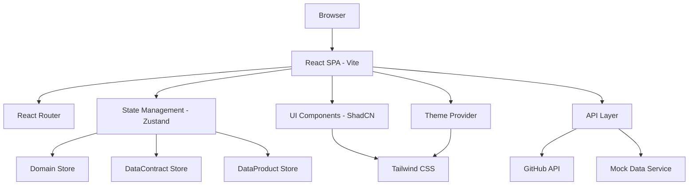
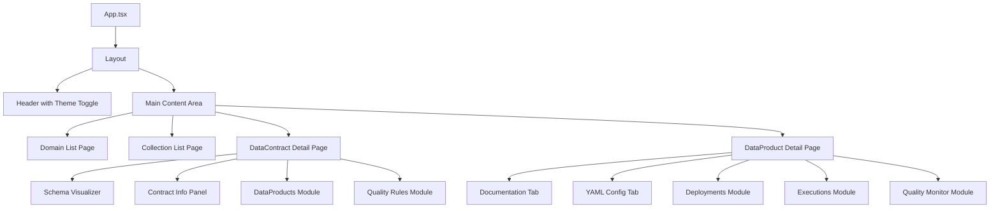

# Design Document

## Overview

O DataContract Catalog é uma aplicação web Single Page Application (SPA) construída com React/Vite que implementa uma arquitetura de navegação hierárquica para gerenciar contratos e produtos de dados. A aplicação utiliza uma estrutura modular baseada em componentes ShadCN UI com roteamento client-side e integração com APIs externas (GitHub) para obter informações de repositórios e documentação.

## Architecture

### High-Level Architecture



### Component Architecture



## Components and Interfaces

### Core Data Models

```typescript
interface DataContract {
  id: string;
  fundamentals: {
    name: string;
    version: string;
    owner: string;
    domain: string;
    collection: string;
  };
  schema: {
    tableName: string;
    columns: Column[];
    dictionary: Record<string, string>;
  };
  qualityRules: QualityRule[];
  tags: {
    layer: 'Bronze' | 'Silver' | 'Gold' | 'Model';
    status: 'published' | 'draft' | 'archived';
    [key: string]: string;
  };
}

interface DataProduct {
  id: string;
  name: string;
  dataContractId: string;
  configJson: Record<string, any>;
  github: {
    repoName: string;
    repoUrl: string;
    pagesUrl: string;
  };
  lastExecution?: ExecutionInfo;
  technology?: string;
}

interface Domain {
  id: string;
  name: string;
  description: string;
  collections: Collection[];
}

interface Collection {
  id: string;
  name: string;
  domainId: string;
  contracts: DataContract[];
}
```

### Key Components

#### 1. Navigation Components
- **DomainCard**: Card component para exibir domínios na página inicial
- **CollectionList**: Lista de coleções dentro de um domínio
- **Breadcrumb**: Navegação hierárquica com contexto atual

#### 2. DataContract Components
- **SchemaVisualizer**: Componente para renderizar schema visual da tabela
- **ContractInfoPanel**: Painel com informações fundamentais do contrato
- **DataProductsModule**: Módulo lateral mostrando produtos associados
- **QualityRulesModule**: Módulo para exibir regras de qualidade

#### 3. DataProduct Components
- **DocumentationTab**: Tab que renderiza GitHub Pages via iframe
- **YamlConfigTab**: Tab para exibir configuração YAML formatada
- **DeploymentsModule**: Módulo mostrando histórico de deployments
- **ExecutionsModule**: Módulo com status de execuções
- **QualityMonitorModule**: Módulo de alertas de qualidade

#### 4. Layout Components
- **AppLayout**: Layout principal com header e área de conteúdo
- **ThemeToggle**: Botão para alternar entre temas claro/escuro
- **Sidebar**: Barra lateral para módulos informativos

### Routing Structure

```
/ - Página inicial com lista de domínios
/domain/:domainId - Lista de coleções do domínio
/domain/:domainId/collection/:collectionId - Lista de contratos da coleção
/contract/:contractId - Página detalhada do contrato
/product/:productId - Página detalhada do produto
```

## Data Models

### Schema Visualization

Para o schema visual, utilizaremos uma representação tabular com:
- Nome da tabela como cabeçalho
- Colunas com tipos de dados
- Indicadores visuais para chaves primárias/estrangeiras
- Tooltips com descrições do dicionário

### State Management

Utilizaremos Zustand para gerenciamento de estado com stores separadas:

```typescript
// Domain Store
interface DomainStore {
  domains: Domain[];
  selectedDomain: Domain | null;
  fetchDomains: () => Promise<void>;
  selectDomain: (id: string) => void;
}

// DataContract Store  
interface DataContractStore {
  contracts: DataContract[];
  selectedContract: DataContract | null;
  fetchContractsByCollection: (collectionId: string) => Promise<void>;
  selectContract: (id: string) => void;
}

// DataProduct Store
interface DataProductStore {
  products: DataProduct[];
  selectedProduct: DataProduct | null;
  fetchProductsByContract: (contractId: string) => Promise<void>;
  selectProduct: (id: string) => void;
}
```

## Error Handling

### API Error Handling
- Implementar interceptors para tratamento centralizado de erros
- Fallbacks para quando APIs externas (GitHub) não estão disponíveis
- Estados de loading e error em todos os componentes que fazem fetch

### User Experience
- Skeleton loaders durante carregamento
- Mensagens de erro amigáveis
- Retry mechanisms para falhas temporárias
- Offline indicators quando aplicável

### Error Boundaries
- React Error Boundaries para capturar erros de componentes
- Páginas de erro customizadas (404, 500)
- Logging de erros para monitoramento

## Testing Strategy

### Unit Testing
- Testes para todos os componentes usando React Testing Library
- Testes para stores Zustand
- Testes para utilitários e helpers
- Mocking de APIs externas

### Integration Testing
- Testes de fluxos completos de navegação
- Testes de integração com GitHub API
- Testes de mudança de tema

### E2E Testing
- Cypress para testes end-to-end
- Cenários críticos de navegação
- Testes de responsividade

### Component Testing
- Storybook para documentação e testes visuais
- Testes de acessibilidade
- Testes de diferentes estados dos componentes

## Technical Implementation Details

### Theme System
- Utilizar o sistema de temas do ShadCN UI
- CSS variables para cores dinâmicas
- Persistência da preferência no localStorage
- Suporte a preferência do sistema operacional

### Performance Optimizations
- Lazy loading de rotas
- Memoização de componentes pesados
- Virtualização para listas grandes
- Code splitting por funcionalidade

### GitHub Integration
- GitHub API para informações de repositórios
- GitHub Pages embedding via iframe com sandbox
- GitHub Actions API para status de deployments
- Rate limiting e caching de requisições

### Responsive Design
- Mobile-first approach
- Breakpoints do Tailwind CSS
- Componentes adaptáveis para diferentes telas
- Touch-friendly interactions

### Accessibility
- Conformidade com WCAG 2.1 AA
- Navegação por teclado
- Screen reader support
- Alto contraste nos temas