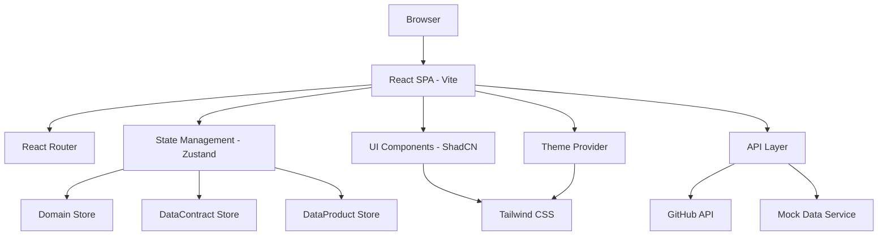
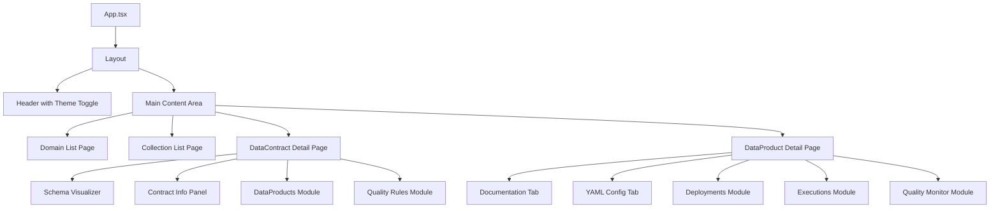
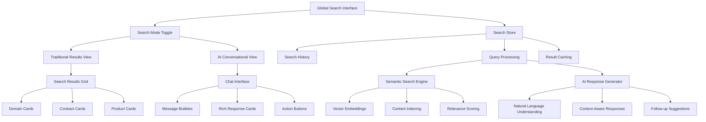

# Design Document

## Overview

O DataContract Catalog é uma aplicação web Single Page Application (SPA) construída com React/Vite que implementa uma arquitetura de navegação hierárquica para gerenciar contratos e produtos de dados. A aplicação utiliza uma estrutura modular baseada em componentes ShadCN UI com roteamento client-side e integração com APIs externas (GitHub) para obter informações de repositórios e documentação.

## Architecture

### High-Level Architecture



### Component Architecture



## Components and Interfaces

### Core Data Models

```typescript
interface DataContract {
  id: string;
  fundamentals: {
    name: string;
    version: string;
    owner: string;
    domain: string;
    collection: string;
  };
  schema: {
    tableName: string;
    columns: Column[];
    dictionary: Record<string, string>;
  };
  qualityRules: QualityRule[];
  tags: {
    layer: 'Bronze' | 'Silver' | 'Gold' | 'Model';
    status: 'published' | 'draft' | 'archived';
    [key: string]: string;
  };
}

interface DataProduct {
  id: string;
  name: string;
  dataContractId: string;
  configJson: Record<string, any>;
  github: {
    repoName: string;
    repoUrl: string;
    pagesUrl: string;
  };
  lastExecution?: ExecutionInfo;
  technology?: string;
}

interface Domain {
  id: string;
  name: string;
  description: string;
  collections: Collection[];
}

interface Collection {
  id: string;
  name: string;
  domainId: string;
  contracts: DataContract[];
}
```

### Key Components

#### 1. Navigation Components
- **DomainCard**: Card component para exibir domínios na página inicial
- **CollectionList**: Lista de coleções dentro de um domínio
- **Breadcrumb**: Navegação hierárquica com contexto atual

#### 2. DataContract Components
- **SchemaVisualizer**: Componente para renderizar schema visual da tabela
- **ContractInfoPanel**: Painel com informações fundamentais do contrato
- **DataProductsModule**: Módulo lateral mostrando produtos associados
- **QualityRulesModule**: Módulo para exibir regras de qualidade

#### 3. DataProduct Components
- **DocumentationTab**: Tab que renderiza GitHub Pages via iframe
- **YamlConfigTab**: Tab para exibir configuração YAML formatada
- **DeploymentsModule**: Módulo mostrando histórico de deployments
- **ExecutionsModule**: Módulo com status de execuções
- **QualityMonitorModule**: Módulo de alertas de qualidade

#### 4. Layout Components
- **AppLayout**: Layout principal com header e área de conteúdo
- **ThemeToggle**: Botão para alternar entre temas claro/escuro
- **Sidebar**: Barra lateral para módulos informativos

### Routing Structure

```
/ - Página inicial com lista de domínios
/domain/:domainId - Lista de coleções do domínio
/domain/:domainId/collection/:collectionId - Lista de contratos da coleção
/contract/:contractId - Página detalhada do contrato
/product/:productId - Página detalhada do produto
```

## Data Models

### Schema Visualization

Para o schema visual, utilizaremos uma representação tabular com:
- Nome da tabela como cabeçalho
- Colunas com tipos de dados
- Indicadores visuais para chaves primárias/estrangeiras
- Tooltips com descrições do dicionário

### State Management

Utilizaremos Zustand para gerenciamento de estado com stores separadas:

```typescript
// Domain Store
interface DomainStore {
  domains: Domain[];
  selectedDomain: Domain | null;
  fetchDomains: () => Promise<void>;
  selectDomain: (id: string) => void;
}

// DataContract Store  
interface DataContractStore {
  contracts: DataContract[];
  selectedContract: DataContract | null;
  fetchContractsByCollection: (collectionId: string) => Promise<void>;
  selectContract: (id: string) => void;
}

// DataProduct Store
interface DataProductStore {
  products: DataProduct[];
  selectedProduct: DataProduct | null;
  fetchProductsByContract: (contractId: string) => Promise<void>;
  selectProduct: (id: string) => void;
}
```

## Error Handling

### API Error Handling
- Implementar interceptors para tratamento centralizado de erros
- Fallbacks para quando APIs externas (GitHub) não estão disponíveis
- Estados de loading e error em todos os componentes que fazem fetch

### User Experience
- Skeleton loaders durante carregamento
- Mensagens de erro amigáveis
- Retry mechanisms para falhas temporárias
- Offline indicators quando aplicável

### Error Boundaries
- React Error Boundaries para capturar erros de componentes
- Páginas de erro customizadas (404, 500)
- Logging de erros para monitoramento

## Testing Strategy

### Unit Testing
- Testes para todos os componentes usando React Testing Library
- Testes para stores Zustand
- Testes para utilitários e helpers
- Mocking de APIs externas

### Integration Testing
- Testes de fluxos completos de navegação
- Testes de integração com GitHub API
- Testes de mudança de tema

### E2E Testing
- Cypress para testes end-to-end
- Cenários críticos de navegação
- Testes de responsividade

### Component Testing
- Storybook para documentação e testes visuais
- Testes de acessibilidade
- Testes de diferentes estados dos componentes

## Technical Implementation Details

### Theme System
- Utilizar o sistema de temas do ShadCN UI
- CSS variables para cores dinâmicas
- Persistência da preferência no localStorage
- Suporte a preferência do sistema operacional

### Performance Optimizations
- Lazy loading de rotas
- Memoização de componentes pesados
- Virtualização para listas grandes
- Code splitting por funcionalidade

### GitHub Integration
- GitHub API para informações de repositórios
- GitHub Pages embedding via iframe com sandbox
- GitHub Actions API para status de deployments
- Rate limiting e caching de requisições

### Responsive Design
- Mobile-first approach
- Breakpoints do Tailwind CSS
- Componentes adaptáveis para diferentes telas
- Touch-friendly interactions

### Accessibility
- Conformidade com WCAG 2.1 AA
- Navegação por teclado
- Screen reader support
- Alto contraste nos temas
## A
I-Powered Semantic Search System

### Search Architecture Overview



### Search Interface Design

#### Global Search Component
- **Trigger**: Accessible via Cmd/Ctrl+K shortcut from any page
- **Location**: Search icon in header navigation (next to cart and notifications)
- **Modal Overlay**: Full-screen search interface with backdrop blur
- **Search Bar**: Intelligent autocomplete with recent searches and suggestions

#### Dual Search Modes

**1. Traditional Results Mode**
- Grid layout with cards for domains, contracts, and products
- Tabbed interface: All | Domains | Contracts | Products
- Search result highlighting and relevance indicators
- Quick action buttons: View Details, Add to Cart, Request Access
- Pagination and infinite scroll for large result sets

**2. AI Conversational Mode**
- Chat-like interface with message bubbles
- Natural language query processing
- Rich responses with embedded cards and links
- Contextual follow-up questions and suggestions
- Conversation history and refinement capabilities

### Semantic Search Engine

#### Content Indexing Strategy
```typescript
interface SearchIndex {
  domains: {
    id: string;
    name: string;
    description: string;
    keywords: string[];
    collections: string[];
  }[];
  contracts: {
    id: string;
    name: string;
    description: string;
    domain: string;
    collection: string;
    schema: SchemaField[];
    qualityRules: string[];
    tags: string[];
  }[];
  products: {
    id: string;
    name: string;
    description: string;
    technology: string;
    contractId: string;
    purpose: string;
    keywords: string[];
  }[];
}
```

#### Query Processing Pipeline
1. **Query Analysis**: Parse natural language intent and extract entities
2. **Semantic Matching**: Use vector embeddings for content similarity
3. **Relevance Scoring**: Combine semantic similarity with popularity and recency
4. **Result Ranking**: Apply user context and personalization factors
5. **Response Generation**: Format results for traditional or conversational display

### AI Response Generation

#### Natural Language Understanding
- Intent classification: discovery, comparison, technical details, access requests
- Entity extraction: domain names, data types, technologies, business purposes
- Context awareness: user role, recent activity, current page context

#### Response Templates
```typescript
interface AIResponse {
  type: 'discovery' | 'explanation' | 'recommendation' | 'comparison';
  message: string;
  cards: SearchResultCard[];
  actions: ActionButton[];
  followUpQuestions: string[];
  relatedSearches: string[];
}
```

#### Example AI Interactions
- **Query**: "Show me fraud detection models in credit cards"
- **Response**: Conversational explanation + relevant ML model products + related contracts
- **Actions**: View Models, Compare Approaches, Request Access, Learn More

- **Query**: "What customer data is available for marketing campaigns?"
- **Response**: Privacy-aware explanation + relevant datasets + compliance information
- **Actions**: View Schemas, Check Access Requirements, Contact Data Owner

### Search Result Components

#### SearchResultCard
```typescript
interface SearchResultCard {
  id: string;
  type: 'domain' | 'contract' | 'product';
  title: string;
  description: string;
  metadata: {
    domain?: string;
    technology?: string;
    lastUpdated?: string;
    qualityScore?: number;
  };
  actions: QuickAction[];
  preview?: {
    schema?: SchemaField[];
    sampleData?: any;
    documentation?: string;
  };
}
```

#### Quick Actions
- **View Details**: Navigate to full detail page
- **Add to Cart**: Add product to access request cart
- **Preview Schema**: Show schema in modal overlay
- **Request Access**: Direct access request for single item
- **Compare**: Add to comparison view
- **Bookmark**: Save to personal catalog

### Advanced Search Features

#### Intelligent Filters
- **Domain**: Filter by business domain (Cartões, Seguros, etc.)
- **Technology**: Filter by tech stack (Databricks, Airflow, MLflow, etc.)
- **Data Type**: Filter by data categories (customer, transaction, risk, etc.)
- **Freshness**: Filter by last update time
- **Quality Score**: Filter by data quality metrics
- **Access Level**: Filter by available access permissions

#### Personalization
- **Role-based suggestions**: Tailor results based on user role (analyst, engineer, etc.)
- **Usage history**: Prioritize frequently accessed content
- **Team context**: Show content relevant to user's team/department
- **Saved searches**: Quick access to frequently used queries
- **Search alerts**: Notifications for new content matching saved searches

### Search Performance Optimization

#### Caching Strategy
- **Query result caching**: Cache search results for 5 minutes
- **Autocomplete caching**: Cache suggestions for 1 hour
- **Index caching**: Update search index every 15 minutes
- **AI response caching**: Cache AI responses for similar queries

#### Progressive Enhancement
- **Instant search**: Show results as user types
- **Lazy loading**: Load additional results on scroll
- **Prefetching**: Preload likely next searches
- **Offline support**: Cache recent searches for offline access

### Integration with Existing Workflows

#### Navigation Integration
- **Header search icon**: Always visible search entry point
- **Keyboard shortcuts**: Cmd/Ctrl+K global search activation
- **Context-aware search**: Pre-populate search based on current page
- **Deep linking**: Shareable URLs for search results

#### Workflow Actions
- **Search → Cart**: Direct integration with access request workflow
- **Search → Details**: Seamless navigation to detail pages
- **Search → Compare**: Multi-select comparison functionality
- **Search → Share**: Share search results with team members

#### Analytics and Insights
- **Search analytics**: Track query patterns and result interactions
- **Content discovery**: Identify popular and underutilized data assets
- **User behavior**: Understand how users discover and access data
- **Performance metrics**: Monitor search response times and accuracy